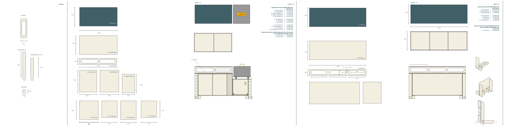
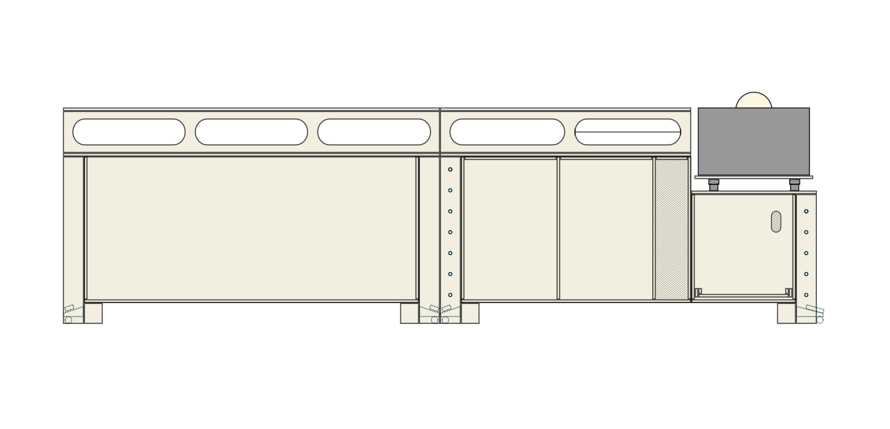
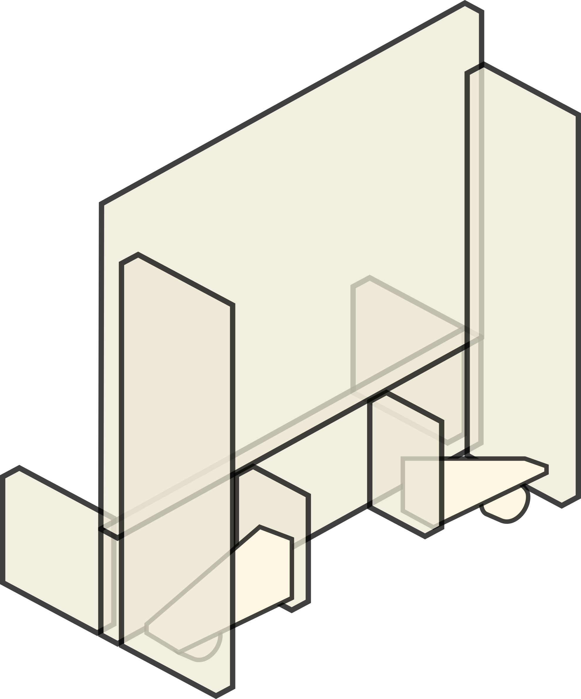

# MFT Workbench Project


It contains the build drawings and cut list for an MFT-style workbench system made from sheet goods and framing stock.

## What’s in this repo

- `20260220-workbench.svg` — source drawing (Inkscape)
- `20260220-workbench.png` — PNG render exported from the SVG
- `20260220-workbench.pdf` — plan export
- `20260220-workbench-cutlist.pdf` — printable cut list

## Drawing summary (from the SVG)

The SVG appears to include:

- Two table configurations: **Table A** and **Table B**
- Labeled part families for cabinets, table structure, drawers, and trolley components
- Dimension callouts in millimeters (e.g. 1800mm, 1200mm, 800mm, 700mm, 600mm, 400mm, 200mm, 100mm, 90mm)
- Material thickness callouts including **17mm** (sheet stock) and **8.5mm** (likely panel/back/bottom detail)

A visual render of the plan:



## Joining concept and castor/feet layout

### Table joining concept



- The two tables are intended to be joined in both orientations:
  - **Laterally** (side-by-side)
  - **In parallel** (end-to-end / aligned runs)
- Use over-center **toggle latches** to clamp and lock the tables together at the join points.
- Reference latch hardware:
  - `./ToggleLatchLarge.webp`
  - `./ToggleLatchSmall.webp`

### Collapsible castors / feet arrangement



- Feet/castors must be arranged as shown in `./CollapsiableCastors.png`.
- Key requirement: the feet/castor hardware must not protrude into the join plane, or the two tables will not mate flush.
- In practice: keep all deployed/retracted castor geometry clear of the mating faces used for table-to-table joining.

## Extracted cut list text (as labeled in the SVG)

> Verify all measurements against the original SVG/PDF before cutting.

### Table A / Cabinet A

- `A.CabinetBack` — qty 3 — `17 x 700 x 400`
- `A.CabinetSide` — qty 6 — `17 x 700 x 600`
- `A.CabinetBottom` — qty 3 — `17 x 600 x 400`
- `A.TableBottom` — qty 1 — `17 x 1800 x 600`
- `A.TableSide` — qty 2 — `17 x 1800 x 200`
- `A.DrawerFace` — qty 20 — `17 x 400 x 140`
- `A.DrawerSides` — qty 40 — `17 x 550 x 110`
- `A.DrawerBase` — qty 20 — `17 x 480 x 332`
- `A.DrawBack` / `A.DrawerBack` — qty 20 — `17 x 332 x 110`
- `A.TableTop` — qty 1 — `17 x 1800 x 600`

### Shared / Support parts

- `TableEnd` — qty 7 — `17 x 566 x 200`
- `TableSupports` — qty 6 — `17 x 800 x 100`
- `TableSupportsTrolly` — qty 2 — `17 x 612 x 100`
- `TableFeet` — qty 8 — `90 x 45 x 100`

### Table B / Cabinet B / Trolley B

- `B.CabinetBack` — qty 1 — `17 x 1200 x 700`
- `B.CabinetSide` — qty 4 — `17 x 600 x 700`
- `B.CabinetBottom` — qty 3 — `17 x 400 x 600`
- `B.TableBottom` — qty 1 — `17 x 1200 x 600`
- `B.TableSide` — qty 2 — `17 x 1200 x 200`
- `B.TrollyBottom` — qty 1 — `17 x 500 x 600`
- `B.TrollyBackFront` — qty 2 — `17 x 500 x 512`
- `B.TrollySides` — qty 2 — `17 x 500 x 600`
- `B.TableTop` — qty 1 — `17 x 1200 x 600`
- `B.TrollyTop` — qty 1 — `17 x 600 x 600`

## Export notes

The original SVG canvas is very large (`16000mm x 4000mm`).
For practical viewing, the PNG in this repo was exported at a fixed width of `3200px`.

Example export command:

```bash
inkscape 20260220-workbench.svg \
  --export-type=png \
  --export-filename=20260220-workbench.png \
  --export-width=3200 \
  --export-background='#ffffff' \
  --export-background-opacity=1
```

---

## Materials required (summarized from the cutlist)

### Sheet goods (`20260220-workbench-cutlist.pdf`)

- Stock size in plan: **2400 x 1200mm**
- Total stock sheets: **8 sheets**
  - **6x** Plywood Construction `17mm`
  - **2x** Plywood Form Film Coated / FormPly `17mm`
- Used area: **14,900,800 mm²** (~**14.90 m²**, **65%**)
- Wasted area: **8,139,200 mm²** (~**8.14 m²**, **35%**)
- Total cuts: **67**
- Total cut length: **62,498 mm**
- Kerf used by optimizer: **3mm**

### Solid stock

- `TableFeet` — **8 pcs** at `90 x 45 x 100mm`

### Notes
- Verify final dimensions against `20260220-workbench-cutlist.pdf` and `20260220-workbench.svg` before cutting.
